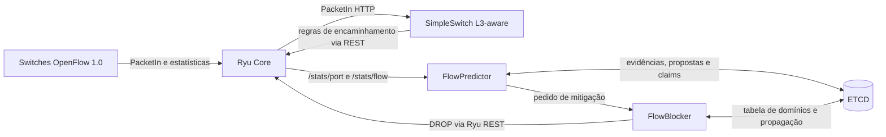

# FlowPredictor

[](https://github.com/portelaariel/sdn_flow_predictor/actions/workflows/validate.yml)

Predição online de vazão, detecção de anomalias e mitigação coordenada de
ataques volumétricos em redes SDN multi-domínio.

O projeto combina quatro camadas:

1. modelo Holt calibrado offline sobre resíduos robustos;
2. inferência online a partir de contadores OpenFlow 1.0;
3. consenso multicritério (MCDA) ou negociação entre agentes de domínio;
4. mitigação cross-domain por meio do FlowBlocker.

O código inclui o testbed Docker/Mininet, preparação do CIC-DDoS2019, modelo
versionado, APIs de observabilidade e runners experimentais com controles de
segurança. Trata-se de um protótipo de pesquisa para laboratório. O modo
`authority-live` instala regras DROP reais no Mininet e não deve ser tratado
como implantação de produção.

## Conteúdo

- [Visão rápida](#visão-rápida)
- [Arquitetura](#arquitetura)
- [Detecção de anomalias](#detecção-de-anomalias)
- [Decisão multi-domínio](#decisão-multi-domínio)
- [Instalação e execução](#instalação-e-execução)
- [Treinamento offline](#treinamento-offline)
- [API REST](#api-rest)
- [Protocolo experimental](#protocolo-experimental)
- [Configuração](#configuração)
- [Estrutura do repositório](#estrutura-do-repositório)
- [Solução de problemas](#solução-de-problemas)
- [Limitações conhecidas](#limitações-conhecidas)

## Visão rápida

### O que a ferramenta faz

- consulta `/stats/port` e `/stats/flow` do Ryu periodicamente;
- transforma contadores cumulativos em vazão (`bit/s`);
- prevê a próxima observação de cada série com Holt;
- pontua o resíduo no espaço `log1p` usando uma distribuição robusta aprendida
  offline;
- registra picos, quedas e surtos de novos fluxos;
- compartilha apenas evidências compactas entre domínios pelo ETCD;
- decide localmente, por MCDA ou por agentes determinísticos;
- delega toda instalação de DROP ao FlowBlocker;
- produz timelines e relatórios reproduzíveis dos experimentos.

### Estado padrão seguro

Os defaults em [`config/runtime.env`](config/runtime.env) mantêm:

- `PREDICTOR_DRY_RUN=true`;
- colaboração desativada;
- agentes desativados;
- atuação agentic live desativada;
- adaptação online do modelo desativada.

O artefato offline também é opt-in no bootstrap comum. Nos runners
experimentais ele é obrigatório e montado automaticamente.

### Validação local

Antes de qualquer experimento ou Pull Request:

```bash
bash scripts/validate_repository.sh
```

O validador verifica AST Python, sintaxe shell, arquivos ativos, configuração,
entradas inválidas, testes unitários, matriz determinística de falhas dos
agentes e smoke test do deploy. Ele não inicia Docker nem Mininet.

## Arquitetura

Há um conjunto de serviços por domínio e um cluster ETCD compartilhado:



### Responsabilidades

| Componente | Responsabilidade |
| --- | --- |
| Ryu Core | sessão OpenFlow, estatísticas e emissão de eventos topológicos |
| SimpleSwitch | aprendizado L2/L3 e regras IPv4 que expõem `nw_src`/`nw_dst` |
| FlowPredictor | coleta, Holt, detecção, colaboração e agentes |
| FlowBlocker | resolução cross-domain e instalação das regras DROP |
| ETCD | estado efêmero compartilhado, propostas e eleição atômica |
| Mininet | plano de dados experimental |

O FlowPredictor não instala flows diretamente. Mesmo quando a decisão vem do
MCDA ou dos agentes, a ação passa por `POST /flowblocker/service`. Essa
separação evita duplicar no detector a lógica de encaminhamento e mitigação.

### Endereçamento padrão

Para o domínio de índice `i`:

| Serviço | IP interno | Porta publicada |
| --- | --- | --- |
| Ryu OpenFlow | `192.168.(10+i).10` | `6633+i` |
| Ryu REST | `192.168.(10+i).10` | `8080+i` |
| SimpleSwitch | `192.168.(10+i).20` | `9090+i` |
| FlowBlocker | `192.168.(10+i).30` | `7070+i` |
| FlowPredictor | `192.168.(10+i).40` | `6060+i` |

O testbed usado pelos runners possui dois domínios, dois switches por domínio
e dois hosts por switch (`h1` a `h8`). O bootstrap aceita outros valores de
`CSETS` e `SPER`, mas as campanhas de promoção e replicação validam
explicitamente a topologia 2×2 e os hosts `h1` a `h8`.

## Detecção de anomalias

### Coleta e séries

O coletor mantém duas granularidades:

| Série | Chave | Uso |
| --- | --- | --- |
| Porta | `port:{dpid}:{port_no}` | observação agregada de enlace |
| Fluxo | `flow:{dpid}:{src}->{dst}` | detecção e mitigação com par IP definido |

Os contadores OpenFlow são cumulativos. A vazão é calculada por:

```text
rate_bps = (byte_count_atual - byte_count_anterior) × 8 / Δt
```

O coletor ignora amostras fora de ordem, tolera reinício de contador e exclui
regras DROP (`actions=[]`) e regras de encaminhamento cobertas por um DROP.
Isso impede que a própria mitigação seja reingerida como tráfego legítimo.

Para fluxos offline, uma amostra zero isolada é tratada como lacuna entre
rajadas. O estado Holt só é reiniciado após
`PREDICTOR_FLOW_IDLE_RESET_SAMPLES` zeros consecutivos (dois por padrão).

### Holt e resíduos robustos

O treinamento seleciona `alpha` e `beta` e grava uma distribuição fixa dos
resíduos normais. No runtime, cada série possui seu próprio nível e tendência,
mas reutiliza a calibração do artefato.

A predição é calculada antes de incorporar a observação atual. O detector usa:

```text
residual = log1p(observed_bps) - log1p(predicted_bps)
z = (residual - residual_center) / residual_scale
```

`residual_center` e `residual_scale` são derivados de mediana e MAD durante o
treinamento. Picos e quedas possuem limiares independentes:

- `spike_z_threshold`: resíduos positivos;
- `drop_z_threshold`: resíduos negativos.

O artefato versionado atual é
[`models/cic2019-drddos-udp-holt.json`](models/cic2019-drddos-udp-holt.json),
schema 3, com `alpha=0.9`, `beta=0`, limiar de pico `5.0`, limiar de queda
`20.0` e duas amostras de alinhamento por série.

### Alinhamento inicial não é treinamento online

As duas primeiras taxas válidas de uma nova série alinham apenas o nível Holt
local. Elas não alteram a escala robusta, os limiares ou o artefato. A terceira
taxa já pode ser classificada.

Por isso o modo offline não usa o warmup adaptativo de 15 amostras. Ainda é
necessário iniciar tráfego benigno antes do ataque: se o ataque estiver ativo
desde as primeiras observações, ele pode compor o alinhamento inicial.

Quando um pico é classificado como anômalo, a observação não atualiza Holt.
Assim, um ataque prolongado não se torna o novo nível normal. Com
`PREDICTOR_ONLINE_MODEL_ADAPTATION=false`, a distribuição de resíduos também
permanece congelada.

Se nenhum artefato for configurado, existe um fallback adaptativo compatível.
Somente esse fallback depende de `PREDICTOR_WARMUP_SAMPLES`. Experimentos da
tese devem usar `PREDICTOR_OFFLINE_MODEL_REQUIRED=true` para impedir fallback
silencioso.

### Tipos de evento

| Evento | Condição | Ação automática |
| --- | --- | --- |
| `THROUGHPUT_SPIKE` | resíduo positivo acima do limiar | somente séries de fluxo podem ser mitigadas |
| `THROUGHPUT_DROP` | resíduo negativo abaixo do limiar | alerta; não instala DROP |
| `NEW_FLOW_SURGE` | contagem de flows muito acima do histórico local | alerta; não instala DROP |

`NEW_FLOW_SURGE` é uma heurística independente do modelo de vazão e possui seu
próprio warmup (`PREDICTOR_FLOW_SURGE_WARMUP_SAMPLES`). Um spike de porta não
tem par origem/destino inequívoco e, portanto, também não é bloqueado.

Eventos repetidos da mesma série são agregados durante
`PREDICTOR_EVENT_COOLDOWN_S`. O registro conserva `first_seen_ns`,
`last_seen_ns`, pico e `suppressed_count`. Esse cooldown reduz duplicação de
eventos; ele não interrompe a classificação das amostras.

### Feedback

`POST /predictor/feedback` ajusta em memória o limiar da série que gerou uma
anomalia:

- `false_positive`: multiplica o lado afetado por `1.25`;
- `true_positive`: multiplica o lado afetado por `0.95`.

Esse feedback não retreina Holt, não altera o JSON offline e não persiste após
o reinício do container. Ele serve para exploração operacional, não substitui
rotulagem, novo treinamento e validação independente.

## Decisão multi-domínio

### MCDA colaborativo

Com `PREDICTOR_COLLABORATION_ENABLED=true`, uma anomalia local vira evidência
candidata. O ETCD recebe somente resumos por fluxo e janela; séries completas e
telemetria normal não são replicadas. Visões duplicadas do mesmo domínio são
agregadas pelo máximo, não pela soma.

O score MCDA usa critérios normalizados em `[0,1]`:

| Critério | Peso padrão |
| --- | ---: |
| severidade | 0,25 |
| corroboração entre domínios | 0,25 |
| razão observado/predito | 0,13 |
| persistência | 0,12 |
| confiabilidade do modelo | 0,08 |
| concordância dos z-scores | 0,07 |
| atualidade | 0,05 |
| especificidade topológica | 0,05 |

Os estados padrão são:

| Faixa | Estado |
| --- | --- |
| sem evidência | `NO_EVIDENCE` |
| `< 0.40` | `NORMAL` |
| `0.40–0.60` | `SUSPECT` |
| `0.60–0.80` | `CORROBORATED` |
| `≥ 0.80`, sem quórum | `WAITING_QUORUM` |
| `≥ 0.80`, com quórum | `MITIGATE` |

Modelos incompatíveis produzem `MODEL_MISMATCH`. Após `MITIGATE`, os domínios
disputam atomicamente `flowpredictor/mitigation-claim/<hash>`. Apenas o
vencedor chama o FlowBlocker.

### Agentes de domínio

Cada agente é determinístico e associado a um domínio. Não há LLM nem
aprendizado por reforço no caminho crítico. O termo *multi-agent* refere-se à
negociação distribuída entre agentes de software com regras explícitas.

O agente calcula confiança local com severidade, razão de vazão, persistência,
confiabilidade do modelo e papel topológico. Ele publica uma proposta efêmera:

- `MITIGATE`;
- `WAIT`;
- `NORMAL`;
- `ABSTAIN`;
- `VETO`.

Para fluxo cross-domain, os agentes responsáveis pela origem e pelo destino
precisam publicar propostas recentes e compatíveis. Dois votos `MITIGATE`, sem
veto, formam `AGREED`. Topologia desconhecida, identidades inconsistentes,
modelo incompatível, TTL expirado ou ausência de agente mantêm o sistema sem
autorização.

### Modos agentic

| Modo | Decisão | Claim agentic | Chamada ao FlowBlocker |
| --- | --- | --- | --- |
| `shadow` | agente negocia e é comparado ao MCDA | não | não |
| `authority-dry-run` | agente passa pelo gate de autoridade | sim | não |
| `authority-live` | agente é a autoridade de mitigação | sim | somente o vencedor |

No `authority-live`, o MCDA permanece observacional: não disputa claim e não
atua. O gate agentic revalida fluxo, identidade, papéis, quórum, modelo,
janela, TTL e topologia imediatamente antes do claim. O deploy exige modelo
offline obrigatório, adaptação online desativada, `dry_run=false`, mitigação
automática e opt-in explícito de atuação.

### Comparação agentic–MCDA

A igualdade no instante da autoridade é uma métrica comparativa, não uma
condição para o agente agir. Os dois mecanismos usam scores e ciclos de
avaliação diferentes.

O avaliador atual considera convergência MCDA quando cada domínio:

1. já está em `MITIGATE` no snapshot de autoridade; ou
2. alcança `MITIGATE` depois da autoridade, dentro da janela configurada e com
   `window_id` em comum com o episódio agentic.

Por padrão, a tolerância futura é 1.000 ms. Uma decisão MCDA anterior na janela
imediatamente precedente não satisfaz esse critério, mesmo que pertença ao
mesmo ataque. Portanto, `comparative_ready=false` pode coexistir com todos os
casos operacionais aprovados. Não se deve aumentar a janela, mudar limiares ou
descartar uma repetição após observar o resultado; uma nova definição precisa
ser congelada antes de uma campanha confirmatória.

### Mitigação cross-domain

O pedido contém `src_ip` e `dst_ip`. O FlowBlocker consulta a tabela agregada,
instala DROP no switch de borda do domínio que recebeu a solicitação e propaga
a política ao peer responsável pelo outro extremo. A evidência experimental
de sucesso exige:

- resposta HTTP 200 do FlowBlocker;
- exatamente um solicitante;
- regra DROP observável nos switches esperados;
- perda de conectividade coerente com a política.

Whitelist, dry-run, cooldown, quórum, identidade de modelo e claims são
guard-rails complementares; nenhum deles substitui autenticação entre domínios.

## Instalação e execução

### Pré-requisitos do host

O testbed foi desenvolvido para Linux e requer:

- Docker;
- Open vSwitch e Mininet;
- Python 3;
- `curl`, `jq`, `iperf3` e `git`;
- acesso a `sudo` para Docker, OVS e Mininet.

`tshark` e `tcpdump` são opcionais e usados somente pelo teste de captura de
`setup_env.sh` quando `RUN_TEST=true`.

### Construir as imagens

Execute a partir da raiz do repositório:

```bash
sudo docker build -t ryu_core_cnsm ryu_apps
sudo docker build -t simpleswitch_cnsm rest_client
sudo docker build -t flow_blocker_cnsm flow_blocker
sudo docker build -t flow_predictor_cnsm -f Dockerfile.flow_predictor .
```

`setup_env.sh` constrói automaticamente apenas a imagem do FlowPredictor quando
ela ainda não existe. As outras três imagens devem existir antes do bootstrap.

### Bootstrap seguro com modelo offline

```bash
PREDICTOR_OFFLINE_MODEL="$PWD/models/cic2019-drddos-udp-holt.json" \
PREDICTOR_OFFLINE_MODEL_REQUIRED=true \
PREDICTOR_ONLINE_MODEL_ADAPTATION=false \
PREDICTOR_EXPORT_ENABLED=false \
  bash eMSN_ENV/setup_env.sh 2 2
```

Esse comando cria três nós ETCD, duas redes de domínio e dois conjuntos de
Ryu, SimpleSwitch, FlowBlocker e FlowPredictor. A mitigação permanece em
dry-run e a decisão é local, pois colaboração e agentes continuam desativados.

Para observar agentes shadow e MCDA sem tocar o plano de dados:

```bash
PREDICTOR_OFFLINE_MODEL="$PWD/models/cic2019-drddos-udp-holt.json" \
PREDICTOR_OFFLINE_MODEL_REQUIRED=true \
PREDICTOR_ONLINE_MODEL_ADAPTATION=false \
PREDICTOR_COLLABORATION_ENABLED=true \
PREDICTOR_COLLAB_MIN_DOMAINS=2 \
PREDICTOR_AGENTIC_ENABLED=true \
PREDICTOR_AGENTIC_MODE=shadow \
PREDICTOR_AGENTIC_SHADOW=true \
PREDICTOR_EXPORT_ENABLED=false \
  bash eMSN_ENV/setup_env.sh 2 2
```

### Iniciar a topologia Mininet

Em outro terminal, também na raiz do repositório:

```bash
sudo CSETS=2 SPER=2 python3 eMSN_ENV/setup_mininet.py
```

Se o shell já estiver em `eMSN_ENV/`, use somente `python3 setup_mininet.py`;
não repita `eMSN_ENV/` no caminho.

No CLI do Mininet, um teste manual seguro pode usar:

```text
mininet> h8 iperf3 -s -D
mininet> h1 ping -c 3 10.0.0.8
mininet> h1 iperf3 -c 10.0.0.8 -u -b 1M -t 12
mininet> h1 iperf3 -c 10.0.0.8 -u -b 100M -t 20
```

O primeiro `iperf3` cria baseline para o mesmo par; o segundo provoca um salto
volumétrico. Os runners experimentais automatizam descoberta, baseline,
ataque, coleta e limpeza e são preferíveis para resultados da tese.

### Verificar os serviços

```bash
sudo docker ps --format 'table {{.Names}}\t{{.Status}}\t{{.Networks}}'

for port in 6060 6061; do
  curl -fsS "http://127.0.0.1:$port/predictor/model" |
    jq '{loaded, mode, schema_version, spike_z_threshold, drop_z_threshold}'
done
```

Para modo offline, espere `loaded=true`, `mode="offline"` e
`schema_version=3`.

### Reimplantar apenas o FlowPredictor

Se ETCD, Ryu, SimpleSwitch, FlowBlocker e as redes já estiverem ativos:

```bash
PREDICTOR_OFFLINE_MODEL="$PWD/models/cic2019-drddos-udp-holt.json" \
PREDICTOR_OFFLINE_MODEL_REQUIRED=true \
PREDICTOR_ONLINE_MODEL_ADAPTATION=false \
  bash deploy_flow_predictor.sh 2 true
```

O primeiro argumento é a quantidade de domínios; o segundo é `dry_run`. O
script não cria redes nem os demais serviços.

### Limpeza

```bash
bash eMSN_ENV/cleanup_setup_env.sh
```

O cleanup padrão remove somente containers, redes e recursos Mininet do
projeto. `--all` remove todos os containers e redes customizadas do host e só
deve ser usado em uma máquina dedicada.

## Treinamento offline

### Por que preparar o CIC-DDoS2019

Uma linha CICFlowMeter representa um fluxo concluído, enquanto o runtime mede
vazão por janelas de polling. Os CSVs originais não devem ser fornecidos
diretamente ao treinador. [`prepare_cicddos2019.py`](prepare_cicddos2019.py)
faz leitura streaming, distribui os bytes pela duração do flow e agrega por par
IP em janelas compatíveis.

Como os arquivos originais são grandes, execute a preparação na máquina que já
armazena o dataset e transfira apenas o CSV compacto e seu `.metadata.json`.
`datasets/` é ignorado pelo Git.

### Preparar treino e validação independentes

Exemplo com `DrDoS_UDP.csv` para treino e `UDP.csv` para validação:

```bash
python3 prepare_cicddos2019.py ~/Downloads/01-12/DrDoS_UDP.csv \
  --attack-label DrDoS_UDP \
  --attack-inbound-only \
  --series-key cic2019:drdos_udp \
  --output datasets/cic2019_drddos_udp_train.csv

python3 prepare_cicddos2019.py ~/Downloads/03-11/UDP.csv \
  --attack-label UDP \
  --attack-inbound-only \
  --series-key cic2019:udp \
  --output datasets/cic2019_udp_validation.csv
```

O filtro de ataque é importante porque `UDP.csv` também contém registros
`MSSQL`. `--attack-inbound-only` mantém a direção atacante→vítima.

Por padrão, a preparação:

1. soma bytes forward e backward;
2. converte o total em bits;
3. distribui o tráfego sobre `Flow Duration`;
4. agrega por `Source IP`→`Destination IP` em janelas de dois segundos;
5. antepõe baseline a séries que contêm somente ataque.

O baseline anteposto é sintético e identificado no CSV. Ele aproxima o roteiro
do Mininet, mas não deve ser descrito como sequência originalmente capturada.

### Treinar

```bash
python3 train_offline_model.py datasets/cic2019_drddos_udp_train.csv \
  --label-column label \
  --normal-label BENIGN \
  --series-priming-samples 2 \
  --output models/cic2019-drddos-udp-holt.json
```

O treinador usa somente trechos normais consecutivos para ajustar Holt,
calibra a escala robusta e escolhe o limiar de pico pela F1 quando existem
rótulos de ataque. O limiar de queda usa o quantil benigno configurado.

O JSON registra hash do dataset compacto, mapeamento das colunas, preparação,
contagens, parâmetros e métricas de calibração. Não edite o artefato
manualmente.

### Avaliar em captura independente

```bash
python3 evaluate_offline_model.py \
  models/cic2019-drddos-udp-holt.json \
  datasets/cic2019_udp_validation.csv \
  --normal-label BENIGN \
  --min-rate-bps 50000 \
  --output models/cic2019-drddos-udp-validation.json
```

O relatório rastreado atual registra, para `ddos_throughput_spike`, precisão
`0.984615`, recall `0.876712`, F1 `0.927536` e taxa de falso positivo
`0.013652`. Essas métricas pertencem ao dataset de validação preparado; não
são garantia de desempenho em outra rede.

### Treinar com histórico do próprio testbed

Os diretórios `prediction_history_domain*/` podem ser usados como entrada:

```bash
python3 train_offline_model.py prediction_history_domain*/ \
  --value-column observed_bps \
  --series-columns flow_key \
  --timestamp-column timestamp \
  --sample-interval-s 2 \
  --output models/mininet-holt.json
```

Sem coluna de ground truth, o treinador assume dados normais e calibra pelo
quantil benigno. A coluna `is_anomaly` exportada é uma decisão do detector, não
um rótulo independente, e não deve ser usada como verdade sem revisão.

## API REST

Cada domínio publica sua instância em `6060+i`.

| Método | Endpoint | Conteúdo |
| --- | --- | --- |
| GET | `/predictor/status` | saúde, contadores, configuração e modos ativos |
| GET | `/predictor/model` | identidade, parâmetros e métricas do modelo |
| GET | `/predictor/predictions?top=N` | séries ordenadas por vazão observada |
| GET | `/predictor/predictions/<key>` | forecast e histórico curto de uma série |
| GET | `/predictor/anomalies?limit=N` | eventos recentes e mitigação |
| GET | `/predictor/collaboration` | evidências, decisões MCDA e claims |
| GET | `/predictor/agent` | propostas, decisões e autoridade agentic |
| GET | `/predictor/export/status` | estado da exportação CSV |
| POST | `/predictor/feedback` | feedback em memória por `anomaly_id` |
| POST | `/predictor/config` | parâmetros operacionais permitidos em runtime |

Exemplos:

```bash
curl -fsS http://127.0.0.1:6060/predictor/status | jq .
curl -fsS 'http://127.0.0.1:6060/predictor/anomalies?limit=10' | jq .
curl -fsS http://127.0.0.1:6060/predictor/collaboration | jq .
curl -fsS http://127.0.0.1:6060/predictor/agent | jq .
```

Feedback:

```bash
curl -fsS -X POST http://127.0.0.1:6060/predictor/feedback \
  -H 'Content-Type: application/json' \
  -d '{"anomaly_id":"<id>","verdict":"false_positive"}' | jq .
```

Configuração em runtime aceita `auto_mitigate`, `dry_run`, `min_rate_bps`,
`cooldown_s` e `event_cooldown_s`. Use booleanos JSON reais, não strings:

```bash
curl -fsS -X POST http://127.0.0.1:6060/predictor/config \
  -H 'Content-Type: application/json' \
  -d '{"event_cooldown_s":60}' | jq .
```

Mudar `dry_run` manualmente não configura quórum, modelo, agentes ou opt-in de
autoridade. Para mitigação live reproduzível, use os runners dedicados.

## Protocolo experimental

### Runner genérico

[`scripts/run_collaborative_benchmark.sh`](scripts/run_collaborative_benchmark.sh)
automatiza:

- limpeza da topologia anterior;
- rebuild opcional das imagens;
- recriação de ETCD e serviços;
- preflight das portas OpenFlow;
- descoberta ARP e tabela de domínios;
- baseline e ataque/controle com `iperf3`;
- polling das APIs a cada 500 ms;
- coleta de logs, timelines, OVS flows e métricas;
- encerramento do Mininet e sumarização.

Não execute outro Mininet ou experimento simultaneamente.

| Modo | Autoridade | Plano de dados |
| --- | --- | --- |
| `local-dry-run` | detectores locais | sem DROP |
| `collaborative-dry-run` | MCDA | sem DROP |
| `collaborative-live` | MCDA | DROP real; exige `--allow-mitigation` |
| `agentic-live` | agentes; MCDA observacional | DROP real; exige `--allow-agentic-mitigation` |

Cenários:

- `benign`: vazão UDP estável;
- `ddos`: baseline seguido por salto volumétrico UDP.

Exemplos seguros:

```bash
bash scripts/run_collaborative_benchmark.sh collaborative-dry-run benign
bash scripts/run_collaborative_benchmark.sh collaborative-dry-run ddos

BENCHMARK_AGENTIC_ENABLED=true \
  bash scripts/run_collaborative_benchmark.sh collaborative-dry-run ddos
```

Taxas e durações podem ser definidas antes do ensaio:

```bash
BENCHMARK_BASELINE_RATE=5M \
BENCHMARK_ATTACK_RATE=200M \
BENCHMARK_ATTACK_DURATION_S=30 \
  bash scripts/run_collaborative_benchmark.sh collaborative-dry-run ddos
```

### Classificação de uma execução

| Classe | Significado |
| --- | --- |
| `TP` | ataque posterior ao gate detectado/mitigado conforme o modo |
| `TN` | controle benigno sem mitigação |
| `FP` | controle benigno gerou decisão de ataque |
| `FN` | ataque válido não gerou a decisão esperada |
| `CONTAMINATED` | spike/decisão ocorreu durante o baseline |
| `INVALID` | infraestrutura, tráfego ou API não produziu medição válida |

Em live mode, o DROP pode interromper o canal de controle do `iperf3` antes do
JSON final. Isso só é aceito como efeito esperado quando a timeline confirma
HTTP 200 do FlowBlocker e o ping final observa perda. Um `iperf3` quebrado,
sozinho, nunca é contado como sucesso.

### Progressão de segurança agentic

Execute os estágios na ordem abaixo. Os runners posteriores procuram os
relatórios aprovados em `experiments/results/`; não remova esses relatórios
entre as etapas.

| Estágio | Comando | Gate principal |
| --- | --- | --- |
| Testes determinísticos | `bash scripts/validate_repository.sh` | falhas injetadas sem autorização insegura |
| Falhas no testbed | `bash scripts/run_agentic_runtime_faults.sh` | fail-closed e recuperação com evidência nova |
| Authority dry-run isolado | `bash scripts/run_agentic_authority_dry_run.sh` | claim único e zero atuação |
| Campanha de promoção | `bash scripts/run_agentic_authority_campaign.sh` | `promotion_ready=true` |
| Canário live | comando abaixo | `canary_ready=true` |
| Campanha live multi-fluxo | comando abaixo | `operational_ready`, `comparative_ready`, `campaign_ready` |
| Replicação estatística | comando abaixo | `replication_ready=true` |

Canário com um controle benigno seguido por um ataque:

```bash
bash scripts/run_agentic_authority_live_canary.sh \
  --allow-agentic-mitigation
```

Campanha live com `h1→h8`, `h2→h7` e `h3→h6`:

```bash
bash scripts/run_agentic_authority_live_campaign.sh \
  --allow-agentic-mitigation
```

Replicação congelada com nove controles e nove ataques, três por fluxo:

```bash
bash scripts/run_agentic_authority_live_replication.sh \
  --allow-agentic-mitigation
```

Os flags `--allow-*` são consentimentos explícitos porque os comandos live
instalam DROP real. Os runners também exigem ancestralidade Git, mesmo SHA-256
do modelo promovido e controles negativos aprovados.

### Resultados e estatística

Cada execução cria um diretório ignorado pelo Git em `experiments/results/`
com:

- commit e SHA-256 do modelo;
- status do workload e JSON do `iperf3`;
- ping antes/depois;
- `timeline.ndjson` com anomalias e decisões;
- logs dos containers e snapshots OVS;
- `summary.json` e `summary.md`.

A replicação exige árvore rastreada limpa, protocolo balanceado, mesmo commit e
modelo, controles antes dos ataques e preflight de disco. O relatório calcula:

- matriz de confusão;
- sensibilidade e especificidade com intervalo de Wilson de 95%;
- distribuição por fluxo;
- intervalo bootstrap de 95% para as médias de latência;
- concordância agentic–MCDA e convergência limitada.

Com nove ataques, mesmo 9/9 acertos geram limite inferior de Wilson próximo de
`0.701`. Isso é incerteza amostral esperada, não erro do detector.

`replication_ready=false` pode resultar de uma única falha comparativa em
cascata: a campanha interna retorna status não zero, `comparative_ready=false`
e `campaign_ready=false`, embora todos os casos operacionais tenham passado.
Inspecione sempre os checks, não apenas o booleano final:

```bash
run="$(find experiments/results -maxdepth 1 -type d \
  -name 'agentic-live-replication-*' | sort | tail -n 1)"

jq '.checks | to_entries | map(select(.value != true))' \
  "$run/replication-summary.json"
```

Para comparar execuções genéricas:

```bash
python3 experiments/summarize_benchmark.py \
  experiments/results/<execução-1> \
  experiments/results/<execução-2> \
  --output experiments/results/comparativo
```

## Configuração

Os defaults ficam em [`config/runtime.env`](config/runtime.env). Uma variável
exportada antes do comando prevalece sobre o default. Também é possível usar:

```bash
SDN_RUNTIME_CONFIG=/caminho/runtime.env bash eMSN_ENV/setup_env.sh 2 2
```

### Variáveis principais

| Variável | Default | Papel |
| --- | --- | --- |
| `PREDICTOR_POLL_INTERVAL_S` | `2.0` | intervalo de coleta |
| `PREDICTOR_MIN_RATE_BPS` | `50000` | piso de alerta/alinhamento |
| `PREDICTOR_FLOW_IDLE_RESET_SAMPLES` | `2` | zeros até reiniciar fluxo |
| `PREDICTOR_OFFLINE_MODEL` | vazio | caminho do artefato JSON |
| `PREDICTOR_OFFLINE_MODEL_REQUIRED` | `false` | falha se o artefato não estiver disponível |
| `PREDICTOR_ONLINE_MODEL_ADAPTATION` | `false` | permite adaptar distribuição residual |
| `PREDICTOR_EXPORT_ENABLED` | `true` | exportação CSV por fluxo |
| `PREDICTOR_AUTO_MITIGATE` | `true` | permite solicitar mitigação |
| `PREDICTOR_DRY_RUN` | `true` | simula a atuação |
| `PREDICTOR_EVENT_COOLDOWN_S` | `60` | agregação de eventos repetidos |
| `PREDICTOR_COOLDOWN_S` | `60` | intervalo entre pedidos de mitigação |
| `PREDICTOR_COLLABORATION_ENABLED` | `false` | habilita MCDA/ETCD |
| `PREDICTOR_COLLAB_MIN_DOMAINS` | `2` | quórum MCDA |
| `PREDICTOR_AGENTIC_ENABLED` | `false` | habilita agente por domínio |
| `PREDICTOR_AGENTIC_MODE` | `shadow` | `shadow`, `authority-dry-run` ou `authority-live` |
| `PREDICTOR_AGENT_REQUIRED_VOTES` | `2` | votos agentic necessários |
| `PREDICTOR_AGENTIC_LIVE_ACTUATION` | `false` | opt-in adicional para atuação agentic |

Não altere pesos ou limiares entre repetições de uma mesma campanha. Os
runners de promoção e replicação gravam o protocolo e verificam identidade do
modelo/commit.

## Estrutura do repositório

| Caminho | Função |
| --- | --- |
| `flow_predictor_cnsm.py` | serviço, coleta, Holt, detecção e API |
| `offline_model.py` | contrato e carregamento do modelo |
| `collaborative_decision.py` | score MCDA puro |
| `domain_agent.py` | propostas e negociação agentic |
| `agent_protocol.py` | esquema e validação das propostas |
| `agent_authority.py` | gate fail-closed e claim agentic |
| `train_offline_model.py` | treinamento offline |
| `prepare_cicddos2019.py` | agregação streaming do CIC-DDoS2019 |
| `evaluate_offline_model.py` | avaliação held-out |
| `models/` | artefato e relatório de validação versionados |
| `ryu_apps/` | Ryu emitter e `ofctl_rest` |
| `rest_client/` | SimpleSwitch L3-aware |
| `flow_blocker/` | mitigação e coordenação cross-domain |
| `eMSN_ENV/` | bootstrap, Mininet e cleanup |
| `scripts/` | validação e runners experimentais |
| `experiments/` | workloads, monitores, avaliadores e sumarizadores |
| `tests/` | testes unitários e wiring |
| `config/runtime.env` | defaults compartilhados |

`eMSN_ENV/experiment_01/` e `eMSN_ENV/teste_manual/` são evidências históricas
e não participam do runtime atual.

## Solução de problemas

### `Dockerfile.flow_predictor: no such file`

O Dockerfile fica na raiz. Volte para ela antes do build:

```bash
cd ~/sdn-ariel/sdn_flow_predictor
sudo docker build -t flow_predictor_cnsm -f Dockerfile.flow_predictor .
```

### `network ryu-network not found`

O deploy isolado pressupõe redes existentes. Execute primeiro:

```bash
bash eMSN_ENV/setup_env.sh 2 2
```

O bootstrap atual cria `ryu-network-0` e `ryu-network-1`.

### Switches sem conexão OpenFlow

Confira as portas publicadas:

```bash
for port in 6633 6634; do
  sudo ovs-ofctl -O OpenFlow10 show "tcp:127.0.0.1:$port"
done
```

Se o host não alcançar diretamente os IPs das redes Docker, use as portas
publicadas ao iniciar o Mininet:

```bash
sudo MININET_CONTROLLER_HOST=127.0.0.1 \
  CSETS=2 SPER=2 python3 eMSN_ENV/setup_mininet.py
```

### ETCD não inicia ao reutilizar o ambiente

`setup_env.sh` remove todos os nós ETCD antigos antes de formar o cluster. Se o
host ainda conservar recursos inconsistentes:

```bash
bash eMSN_ENV/cleanup_setup_env.sh
bash eMSN_ENV/setup_env.sh 2 2
```

Falhas de bootstrap são registradas em `logs/run-*/etcd-bootstrap-error.log`.

### APIs no servidor SSH não abrem no navegador local

`127.0.0.1` no navegador é o seu computador, não o servidor. Crie túneis no
computador local:

```bash
ssh -N \
  -L 16060:127.0.0.1:6060 \
  -L 16061:127.0.0.1:6061 \
  -L 17070:127.0.0.1:7070 \
  -L 17071:127.0.0.1:7071 \
  ubuntu@<servidor>
```

Depois acesse `http://127.0.0.1:16060/predictor/status`.

### Não aparecem predições após o deploy

O deploy não cria tráfego nem switches. Inicie o Mininet, gere tráfego e
aguarde os ciclos de polling. Em modo offline, duas taxas válidas alinham a
série e a terceira pode ser classificada.

### Execução longa por SSH

Campanhas live e replicações devem ser executadas em `tmux` ou ferramenta
equivalente. Os resultados são gravados incrementalmente em
`experiments/results/`.

### Pouco espaço em disco

Os benchmarks desabilitam o histórico CSV por padrão, mas preservam logs e
timelines. Verifique espaço antes de uma replicação:

```bash
df -h .
du -sh experiments/results/* 2>/dev/null | sort -h | tail
```

O runner de replicação exige 512 MiB livres por padrão. Remova somente
resultados já arquivados; não apague os relatórios de promoção/canário exigidos
pelos estágios seguintes.

## Limitações conhecidas

- O artefato atual foi treinado para comportamento volumétrico UDP com
  CIC-DDoS2019. Ele não inspeciona payload e não substitui um classificador
  multiclasse de ataques.
- O baseline sintético anteposto pela preparação aproxima o roteiro do testbed,
  mas não é tráfego originalmente capturado.
- Os domínios compartilham evidências e propostas, não datasets nem parâmetros
  treinados. A arquitetura atual não é Federated Learning.
- Os agentes são determinísticos; ainda não há LLM, RL ou atualização autônoma
  da política.
- A comparação estrita MCDA usa mesma janela e tolerância futura. Decisões MCDA
  anteriores em janela adjacente podem ser registradas como divergência.
- Feedback altera somente o processo em memória e desaparece no restart.
- O testbed não autentica criptograficamente propostas agentic. ETCD usa
  `ALLOW_NONE_AUTHENTICATION=yes`; domínios administrativos não confiáveis
  exigiriam ACL, mTLS ou assinatura.
- A topologia dos runners de campanha é fixa em 2×2. Escalabilidade para mais
  domínios precisa ser medida, não inferida apenas do custo assintótico.
- Resultados com nove ataques possuem intervalos de confiança amplos, mesmo
  quando a taxa observada de acerto é 100%.

## Integração contínua

O workflow [`.github/workflows/validate.yml`](.github/workflows/validate.yml)
executa `scripts/validate_repository.sh` em Pull Requests, pushes para `main` e
execuções manuais. O job não precisa de Docker, Mininet, secrets ou acesso ao
servidor do testbed.
