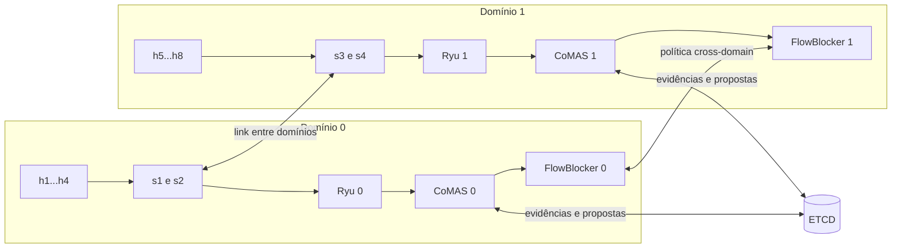
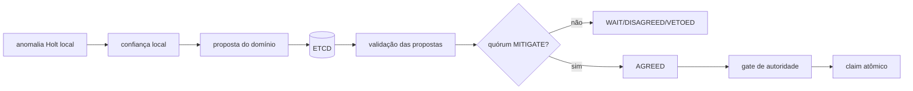

# Coordinated Multi-Domain Agent-Based defense for SDN (CoMAS)

[](https://github.com/portelaariel/sdn_flow_predictor/actions/workflows/validate.yml)

O Coordinated Multi-Domain Agent-Based defense for SDN (CoMAS) é um framework
de pesquisa para detecção e mitigação de ataques volumétricos em uma rede SDN com
mais de um domínio. Ele observa o tráfego através de controladores
Ryu, prevê a vazão esperada, identifica desvios e coordena
decisões e políticas de bloqueio entre os domínios.

> **Aviso:** este é um ambiente de laboratório. O modo `authority-live` instala
> regras DROP reais nos switches do Mininet. Comece sempre pelos modos
> `dry-run`, que detectam e decidem sem bloquear tráfego.

## Sumário

- [O que será executado](#o-que-será-executado)
- [Conceitos essenciais](#conceitos-essenciais)
- [Requisitos e preparação](#requisitos-e-preparação)
- [Execução segura em dry-run](#execução-segura-em-dry-run)
- [Benchmark automatizado](#benchmark-automatizado)
- [Como a detecção funciona](#como-a-detecção-funciona)
- [Como a decisão multi-domínio funciona](#como-a-decisão-multi-domínio-funciona)
- [Como a mitigação funciona](#como-a-mitigação-funciona)
- [Treinamento offline](#treinamento-offline)
- [Experimentos avançados](#experimentos-avançados)
- [API REST](#api-rest)
- [Configuração](#configuração)
- [Estrutura do repositório](#estrutura-do-repositório)
- [Solução de problemas](#solução-de-problemas)
- [Limitações e interpretação dos resultados](#limitações-e-interpretação-dos-resultados)

## O que será executado

A topologia padrão possui dois domínios. Cada domínio tem um controlador Ryu,
um SimpleSwitch, um FlowBlocker e uma instância CoMAS. Três containers ETCD
mantêm o estado compartilhado. O Mininet cria quatro switches e oito hosts.



Na topologia 2×2:

| Domínio | Controlador | Switches | Hosts |
| --- | --- | --- | --- |
| 0 | `192.168.10.10` | `s1`, `s2` | `h1` a `h4` |
| 1 | `192.168.11.10` | `s3`, `s4` | `h5` a `h8` |

Um teste típico cria tráfego entre `h1` (`10.0.0.1`) e `h8`
(`10.0.0.8`). Primeiro é gerado tráfego benigno de baixa vazão; depois a taxa
aumenta para simular um ataque volumétrico.

### Papel de cada componente

| Componente | Função |
| --- | --- |
| Mininet | Cria hosts, links e switches virtuais no servidor Linux. |
| Open vSwitch | Implementa os switches e recebe regras OpenFlow. |
| Ryu | É o controlador SDN. Mantém a sessão OpenFlow e expõe estatísticas por API. |
| SimpleSwitch | Aprende onde estão os hosts e instala regras de encaminhamento IPv4. |
| CoMAS | Calcula vazão, faz a previsão, detecta anomalias e coordena decisões. |
| FlowBlocker | Converte uma decisão autorizada em regras DROP nos switches. |
| ETCD | Compartilha evidências, propostas e claims entre os domínios. |
| `iperf3` | Gera o tráfego benigno e o ataque experimental. |

O CoMAS não instala regras diretamente. Toda mitigação passa pelo
FlowBlocker.

## Conceitos essenciais

Os termos a seguir aparecem nos logs e relatórios:

- **SDN:** arquitetura que separa os switches, responsáveis por encaminhar
  pacotes, do controlador, responsável por decidir as regras.
- **Domínio:** conjunto de switches administrado por uma instância de
  controlador. O testbed usa dois domínios para estudar coordenação.
- **Fluxo:** tráfego identificado, neste projeto, principalmente pelo par
  `IP de origem → IP de destino`.
- **Vazão:** quantidade de bits observada por segundo (`bit/s` ou `bps`).
- **Baseline:** tráfego normal usado como referência antes do ataque. No
  runtime offline ele alinha o estado inicial da série; não retreina o modelo.
- **Holt:** método de previsão que acompanha nível e tendência de uma série
  temporal.
- **Resíduo:** diferença entre o valor observado e o previsto.
- **Anomalia:** resíduo estatisticamente distante do comportamento calibrado
  como normal.
- **Dry-run:** a ferramenta detecta e registra a ação que tentaria executar,
  mas não chama o FlowBlocker para bloquear o tráfego.
- **MCDA:** decisão multicritério que combina várias evidências em um score.
- **Agente:** software determinístico de um domínio. Não é um LLM. Ele interpreta
  a evidência local, publica uma proposta e negocia com o outro domínio.
- **Quórum:** quantidade mínima de domínios que precisam confirmar o ataque.
- **Claim:** eleição atômica que permite a somente um domínio executar uma
  decisão já aprovada.

### Treino, alinhamento e inferência são etapas diferentes

Essa distinção evita uma confusão comum:

1. **Treinamento offline:** executado previamente sobre um dataset rotulado.
   Produz o arquivo JSON do modelo.
2. **Alinhamento da série:** quando um fluxo novo aparece, as primeiras taxas
   inicializam o nível local do Holt. Isso não modifica o arquivo treinado.
3. **Inferência online:** a cada nova coleta, o modelo prevê, compara com o
   observado e classifica o desvio.

O repositório já contém um modelo treinado; os CSVs completos do CIC-DDoS2019 não
são necessários para executar o ambiente padrão.

## Requisitos e preparação

### Onde executar cada comando

O runtime precisa de um **ambiente Linux** porque utiliza Mininet, Open vSwitch
e redes Docker.

Os blocos deste README usam três rótulos:

- **SERVIDOR — raiz:** shell Linux dentro da raiz do repositório;
- **SERVIDOR — Mininet:** segundo shell Linux que permanecerá no CLI do
  Mininet;
- **COMPUTADOR PESSOAL:** terminal, se for o seu caso, usado apenas quando
  explicitamente indicado.

Descubra a raiz a qualquer momento com:

```bash
git rev-parse --show-toplevel
```

Acessar antes de executar os comandos:

```bash
cd "$(git rev-parse --show-toplevel)"
```

### Requisitos do servidor

O testbed foi desenvolvido para Linux e requer:

- Docker;
- Open vSwitch e Mininet;
- Python 3;
- `git`, `curl`, `jq`, `iperf3` e `tmux`;
- permissão de `sudo` para Docker, OVS e Mininet.

Instalação inicial típica:

```bash
sudo apt update
sudo apt install -y \
  docker.io openvswitch-switch mininet \
  python3 python3-pip git curl jq iperf3 tmux

sudo systemctl enable --now docker
sudo systemctl enable --now openvswitch-switch
```

`tshark` e `tcpdump` são opcionais. Eles só são necessários para a captura
adicional habilitada por `RUN_TEST=true` no bootstrap manual.

Confirme os comandos obrigatórios:

```bash
for command in docker ovs-vsctl mn python3 git curl jq iperf3; do
  command -v "$command" || echo "FALTA: $command"
done
```

### Obter o repositório

Se o repositório ainda não existe no ambiente:

```bash
git clone https://github.com/portelaariel/sdn_flow_predictor.git
cd sdn_flow_predictor
```

Se ele já existe:

```bash
cd ~/sdn-ariel/sdn_flow_predictor
git switch main
git pull --ff-only origin main
```

O caminho pode ser diferente no seu cenário. O importante é que
`git rev-parse --show-toplevel` termine no diretório que contém
`Dockerfile.flow_predictor`, `eMSN_ENV/`, `scripts/` e `models/`.

### Verificar o código antes de usar Docker

Na raiz do repositório:

```bash
bash scripts/validate_repository.sh
```

Esse comando verifica sintaxe Python e shell, configuração, testes unitários,
falhas determinísticas dos agentes e o formato do deploy. Ele não inicia
containers nem o Mininet. O final esperado contém testes `OK` e
`deploy_smoke: ok`.

## Execução segura em dry-run

Esta seção usa o modelo offline incluído, dois domínios e `dry-run`. Nenhuma
regra de bloqueio será instalada pelo CoMAS.

### 1. Construir as quatro imagens

**AMBIENTE LINUX — raiz**

```bash
sudo docker build -t ryu_core_cnsm ryu_apps
sudo docker build -t simpleswitch_cnsm rest_client
sudo docker build -t flow_blocker_cnsm flow_blocker
sudo docker build -t flow_predictor_cnsm -f Dockerfile.flow_predictor .
```

O ponto final no quarto comando é o contexto de build e não pode ser omitido.
`setup_env.sh` consegue construir a imagem do CoMAS quando necessário,
mas pressupõe que as outras três imagens já existam.

Confirme:

```bash
sudo docker image ls --format '{{.Repository}}' |
  grep -E '^(ryu_core_cnsm|simpleswitch_cnsm|flow_blocker_cnsm|flow_predictor_cnsm)$' |
  sort -u
```

### 2. Criar os serviços dos dois domínios

**AMBIENTE LINUX — raiz**

```bash
PREDICTOR_OFFLINE_MODEL="$PWD/models/cic2019-drddos-udp-holt.json" \
PREDICTOR_OFFLINE_MODEL_REQUIRED=true \
PREDICTOR_ONLINE_MODEL_ADAPTATION=false \
PREDICTOR_EXPORT_ENABLED=false \
  bash eMSN_ENV/setup_env.sh 2 2
```

Os dois argumentos finais significam:

- primeiro `2`: quantidade de domínios/controladores;
- segundo `2`: quantidade de switches por domínio.

O comando cria as redes Docker, os três nós ETCD e os serviços dos domínios.
Ele ainda não cria os hosts ou switches do Mininet. O modelo é obrigatório,
a adaptação online está desativada e o modo padrão continua `dry-run=true`.

O final esperado informa que `flow-predictor-0` e `flow-predictor-1` estão
prontos. Confirme os containers:

```bash
sudo docker ps --format 'table {{.Names}}\t{{.Status}}\t{{.Networks}}'
```

Devem existir, no mínimo:

```text
etcd1, etcd2, etcd3
ryu-core-0, simple-switch-0, flow-blocker-0, flow-predictor-0
ryu-core-1, simple-switch-1, flow-blocker-1, flow-predictor-1
```

### 3. Confirmar que o modelo foi carregado

**AMBIENTE LINUX — raiz**

```bash
for port in 6060 6061; do
  echo "=== Porta $port ==="
  curl -fsS "http://127.0.0.1:$port/predictor/model" |
    jq '{loaded, mode, schema_version, spike_z_threshold, drop_z_threshold}'
done
```

O resultado correto para as duas portas contém:

```json
{
  "loaded": true,
  "mode": "offline",
  "schema_version": 3,
  "spike_z_threshold": 5,
  "drop_z_threshold": 20
}
```

Se aparecer `mode: "adaptive"`, pare o teste: o modelo offline não foi
montado e o comportamento não corresponde ao protocolo descrito aqui.

### 4. Abrir a topologia Mininet

Abra uma segunda conexão SSH ou uma nova janela do `tmux`.

**AMBIENTE LINUX — Mininet**

```bash
cd ~/sdn-ariel/sdn_flow_predictor
sudo MININET_CONTROLLER_HOST=127.0.0.1 \
  CSETS=2 SPER=2 python3 eMSN_ENV/setup_mininet.py
```

Usar `127.0.0.1` faz os switches alcançarem as portas OpenFlow publicadas
pelos containers (`6633` e `6634`). Isso evita problemas de rota para as
bridges Docker.

Confira conectividade básica:

```text
pingall
```

Na primeira tentativa podem ocorrer perdas enquanto ARP e regras de
encaminhamento são aprendidos. Repita `pingall`; uma topologia pronta deve
alcançar todos os hosts.

### 5. Gerar baseline e ataque manualmente

Ainda no **AMBIENTE LINUX — Mininet**:

```text
h8 iperf3 -s -D
h1 ping -c 3 10.0.0.8
h1 iperf3 -c 10.0.0.8 -u -b 1M -t 12
h1 iperf3 -c 10.0.0.8 -u -b 100M -t 20
```

O que cada linha faz:

1. inicia em `h8` o servidor `iperf3` em segundo plano;
2. confirma que `h1` alcança `h8`;
3. cria doze segundos de tráfego benigno de aproximadamente 1 Mbit/s;
4. aumenta a taxa solicitada para 100 Mbit/s durante vinte segundos.

O salto de 1 Mbit/s para 100 Mbit/s é o evento que o detector deve observar.
Como o ambiente está em dry-run, o tráfego não será bloqueado.

### 6. Verificar a detecção

Volte ao **AMBIENTE LINUX — raiz**:

```bash
for port in 6060 6061; do
  echo "=== CoMAS $port ==="
  curl -fsS "http://127.0.0.1:$port/predictor/anomalies?limit=20" |
    jq '[.anomalies[] |
      select(.meta.nw_src == "10.0.0.1" and .meta.nw_dst == "10.0.0.8") |
      {kind, key, observed_bps, predicted_bps, z_score, mitigation}]'
done
```

Um ataque detectado aparece como `THROUGHPUT_SPIKE`, com `observed_bps` muito
acima de `predicted_bps`. Em dry-run, a mitigação pode indicar
`attempted: true`, `executed: false` e `reason: "DRY_RUN"`.

Se a lista estiver vazia, aguarde pelo menos três ciclos de coleta e consulte
`/predictor/predictions?top=500`. A seção de solução de problemas apresenta
outras verificações.

### 7. Encerrar o ambiente

No **AMBIENTE LINUX — Mininet**:

```text
exit
```

Depois, no **AMBIENTE LINUX — raiz**:

```bash
bash eMSN_ENV/cleanup_setup_env.sh
```

O cleanup padrão remove somente containers, redes e recursos Mininet deste
projeto. Não use `--all` em um servidor compartilhado: essa opção remove todos
os containers e redes customizadas do host.

## Benchmark automatizado

O runner automatiza limpeza, bootstrap, Mininet, tráfego, polling, coleta de
resultados e sumarização.

Não mantenha outro Mininet ou benchmark ativo ao mesmo tempo.

### 1. Controle benigno

**SERVIDOR — raiz**

```bash
bash scripts/run_collaborative_benchmark.sh collaborative-dry-run benign
```

O cenário mantém uma taxa estável. O resultado esperado é `TN` (*true
negative*): havia tráfego benigno e não houve decisão de mitigação.

### 2. Ataque em dry-run

```bash
bash scripts/run_collaborative_benchmark.sh collaborative-dry-run ddos
```

O cenário cria baseline e depois aumenta a vazão. O resultado esperado é `TP`
(*true positive*): o ataque válido foi detectado e corroborado, mas nenhuma
regra DROP foi instalada.

Cada execução cria um diretório em `experiments/results/`. O caminho é exibido
na última linha. Os principais arquivos são:

| Arquivo | O que contém |
| --- | --- |
| `summary.md` | tabela legível da execução |
| `summary.json` | métricas estruturadas para scripts e `jq` |
| `timeline.ndjson` | snapshots de detecção, MCDA e agentes ao longo do tempo |
| `workload_status.json` | validade de baseline, ataque, ping e controladores |
| `mininet.log` | saída da topologia e do `iperf3` |
| `flow-predictor-*.log` | logs dos detectores |
| `flow-blocker-*.log` | pedidos e instalação de políticas |
| `ovs-flows-*.txt` | regras OpenFlow observadas ao final |

As classes possíveis são:

| Classe | Significado |
| --- | --- |
| `TP` | ataque válido gerou a decisão esperada |
| `TN` | tráfego benigno não gerou mitigação |
| `FP` | tráfego benigno foi classificado como ataque |
| `FN` | ataque válido não gerou a decisão esperada |
| `CONTAMINATED` | anomalia apareceu antes do início oficial do ataque |
| `INVALID` | infraestrutura ou workload não permitiu uma medição válida |

`INVALID` não é `FN`, e `CONTAMINATED` não deve ser descartado.
Ambos indicam que a repetição não pode sustentar a conclusão pretendida.

### Auditoria pós-experimento com LLM

O módulo opcional `llm_auditor` agrupa as transições do mesmo episódio e
verifica deterministicamente quórum, autorização, claim único e execução. Ele
lê apenas os artefatos de uma execução concluída e não publica no ETCD, chama
o FlowBlocker ou altera decisões do CoMAS.

Primeiro produza o relatório que serve como referência reproduzível:

```bash
python3 -m llm_auditor experiments/results/<execução> --mode audit
```

Para acrescentar uma explicação via Ollama sem permitir que a LLM altere o
veredito:

```bash
python3 -m llm_auditor experiments/results/<execução> \
  --mode explain \
  --model qwen3.5:9b \
  --ollama-url http://127.0.0.1:12434
```

O modo `evaluate` é exclusivamente experimental: ele oculta o veredito da LLM
e registra a concordância campo a campo com o avaliador determinístico. Os
detalhes e o contrato de saída estão em `llm_auditor/README.md`.

Para testar isoladamente se a LLM interpreta seis estados representativos do
protocolo, execute a campanha de fixtures sintéticas:

```bash
python3 -m llm_auditor.protocol_campaign \
  --model qwen3.5:9b \
  --ollama-url http://127.0.0.1:12434 \
  --seeds 42 \
  --output llm_protocol_campaign.json
```

Cada entrada é identificada como `synthetic_protocol_fixture`. Portanto, essa
campanha mede interpretação semântica da LLM, não desempenho ou escalabilidade
da rede real. Repetições das mesmas fixtures também não são tratadas como
experimentos de rede independentes.

## Como a detecção funciona

### 1. Leitura dos contadores OpenFlow

A cada dois segundos, por padrão, o CoMAS consulta o Ryu:

- `/stats/port/<dpid>` para dados agregados de portas;
- `/stats/flow/<dpid>` para fluxos com IP de origem e destino.

Os switches informam contadores cumulativos de bytes. Se um fluxo tinha 1.000
bytes e na coleta seguinte tem 3.000, o intervalo transportou 2.000 bytes. A
vazão é:

```text
rate_bps = (byte_count_atual - byte_count_anterior) × 8 / Δt
```

O coletor rejeita amostras fora de ordem, reconhece reinício do contador e não
reingere regras DROP como tráfego legítimo. Uma série de porta serve para
observação agregada; somente uma série de fluxo contém o par origem/destino
necessário para bloquear tráfego.

### 2. Previsão Holt

Para cada série ativa, Holt mantém:

- **nível:** valor atual estimado da série;
- **tendência:** direção de crescimento ou queda.

O modelo calcula a previsão antes de incorporar a nova observação. Os
parâmetros `alpha` e `beta` controlam quanto nível e tendência reagem às
amostras. O artefato incluído usa `alpha=0.9` e `beta=0`.

As duas primeiras taxas válidas alinham o estado local de uma série nova. A
terceira taxa já pode ser classificada. Esse alinhamento não altera `alpha`,
`beta`, os limiares ou o JSON do modelo.

### 3. Resíduo e z-score robusto

O detector trabalha em escala logarítmica para reduzir o efeito de magnitudes
muito diferentes:

```text
residual = log1p(observed_bps) - log1p(predicted_bps)
z = (residual - residual_center) / residual_scale
```

`residual_center` e `residual_scale` foram obtidos offline por mediana e MAD,
medidas robustas a valores extremos. Um `z` positivo grande representa uma
subida inesperada; um `z` negativo grande em módulo representa uma queda.

O modelo atual usa limiar `5.0` para picos e `20.0` para quedas. Eles são
independentes porque parar um fluxo pode produzir uma queda legítima, enquanto
o objetivo principal é detectar aumentos volumétricos.

Quando um pico é classificado como ataque, essa amostra não atualiza o Holt.
Isso evita que um ataque prolongado seja absorvido como o novo normal.

### 4. Tipos de anomalia

| Evento | Interpretação | Pode gerar DROP? |
| --- | --- | --- |
| `THROUGHPUT_SPIKE` de fluxo | vazão acima da previsão e do limiar | sim |
| `THROUGHPUT_DROP` | vazão caiu muito abaixo da previsão | não |
| `NEW_FLOW_SURGE` | quantidade de novos fluxos aumentou abruptamente | não |
| spike de porta | aumento agregado, sem par IP inequívoco | não |

Eventos repetidos da mesma série são agrupados durante o cooldown. O primeiro
registro mantém `first_seen_ns`; as repetições atualizam `last_seen_ns`, pico e
`suppressed_count`. Agrupar eventos não significa que a classificação parou.

### 5. Fallback adaptativo

Se nenhum artefato offline for configurado, existe um modo que aprende
um baseline inicial com `PREDICTOR_WARMUP_SAMPLES`. Ele é útil apenas para
compatibilidade. Experimentos reproduzíveis devem definir:

```text
PREDICTOR_OFFLINE_MODEL_REQUIRED=true
PREDICTOR_ONLINE_MODEL_ADAPTATION=false
```

Assim, uma falha ao montar o modelo interrompe o deploy em vez de mudar
silenciosamente para outro detector.

### 6. Feedback não é retreinamento

`POST /predictor/feedback` pode elevar temporariamente o limiar de uma série
marcada como falso positivo ou reduzi-lo após um verdadeiro positivo. A
alteração:

- existe somente na memória do container;
- afeta somente a série indicada;
- desaparece no restart;
- não modifica o modelo JSON;
- não substitui novo treinamento com rótulos independentes.

## Como a decisão multi-domínio funciona

Detecção e decisão são etapas distintas. O Holt responde “esta observação é
estatisticamente anômala?”. MCDA ou agentes respondem “há evidência suficiente
e segura para autorizar uma mitigação distribuída?”.

### MCDA: combinação ponderada de critérios

MCDA significa *Multi-Criteria Decision Analysis*. O método atual usa uma soma
ponderada: cada critério é normalizado para `[0,1]`, multiplicado pelo seu peso
e somado.

```text
score = Σ (critério_normalizado × peso)
```

| Critério | O que mede | Peso padrão |
| --- | --- | ---: |
| severidade | quanto o z-score excede o limiar | 0,25 |
| corroboração | fração dos domínios que confirmam | 0,25 |
| razão de vazão | observado dividido pelo previsto | 0,13 |
| persistência | quantidade de janelas anômalas | 0,12 |
| confiabilidade | métrica registrada no modelo offline | 0,08 |
| concordância | proximidade dos z-scores entre domínios | 0,07 |
| atualidade | quão recente é a evidência | 0,05 |
| topologia | se a evidência identifica um fluxo específico | 0,05 |

Os pesos atuais são uma hipótese de engenharia, não valores aprendidos pelo
Holt ou copiados do CIC-DDoS2019. A literatura de MCDA fundamenta a soma
ponderada; os valores específicos precisam ser justificados por calibração,
ablação e análise de sensibilidade antes de uma conclusão definitiva.

Referências metodológicas:

- P. C. Fishburn, “Additive Utilities with Incomplete Product Sets”,
  *Operations Research*, 1967, DOI
  [10.1287/opre.15.3.537](https://doi.org/10.1287/opre.15.3.537).
- E. Triantaphyllou, *Multi-Criteria Decision Making Methods: A Comparative
  Study*, Springer, 2000, DOI
  [10.1007/978-1-4757-3157-6](https://doi.org/10.1007/978-1-4757-3157-6).

O score produz:

| Condição padrão | Estado |
| --- | --- |
| nenhuma evidência recente | `NO_EVIDENCE` |
| score menor que 0,40 | `NORMAL` |
| 0,40 até menos de 0,60 | `SUSPECT` |
| 0,60 até menos de 0,80 | `CORROBORATED` |
| pelo menos 0,80, mas sem quórum | `WAITING_QUORUM` |
| pelo menos 0,80 e com quórum | `MITIGATE` |

Evidências antigas são descartadas. Se os domínios não utilizarem o mesmo
modelo, o estado é `MODEL_MISMATCH`. Em modo MCDA live, somente depois de
`MITIGATE` ocorre a eleição do domínio executor.

### Agente de cada domínio

Cada instância CoMAS pode executar um agente determinístico. Ele não conversa
em linguagem natural e não usa LLM ou aprendizado por reforço. Suas regras são
explícitas e testáveis.

O ciclo é:



O agente local considera severidade, razão entre observado e previsto,
persistência, confiabilidade do modelo e seu papel na topologia. Ele publica:

- `MITIGATE`: acredita que o evento deve ser mitigado;
- `WAIT`: ainda não possui confiança suficiente;
- `NORMAL`: a evidência não confirma ataque;
- `ABSTAIN`: o domínio não é responsável por origem ou destino;
- `VETO`: uma regra de segurança impede a ação.

Para um fluxo entre domínios, os agentes de origem e destino precisam enviar
propostas recentes para o mesmo fluxo, mesma janela temporal e mesmo modelo.
Dois votos `MITIGATE`, sem veto, formam `AGREED`. Um agente ausente, topologia
desconhecida, TTL expirado ou divergência de modelo impede autorização.

### Todos decidem, somente um executa

Após `AGREED`, cada domínio revalida o evento no gate de autoridade. O gate
confere fluxo, papéis topológicos, quórum, propostas, modelo, janela e TTL. Os
agentes aprovados disputam uma chave exclusiva no ETCD:

```text
flowpredictor/agent-mitigation-claim/<hash-do-fluxo>
```

A operação é equivalente a:

```text
SE a versão da chave ainda é zero:
    criar a chave com meu controller_id e vencer
SENÃO:
    ler a chave e reconhecer o vencedor
```

O ETCD serializa as transações. Mesmo que os dois tentem simultaneamente,
somente um consegue criar a chave. Esse domínio recebe `won=true`; o outro
recebe `won=false` e o identificador do coordenador.

A eleição atual é *first valid writer wins*. Ela não escolhe o maior score e
não privilegia origem, destino ou menor endereço IP. O primeiro claim válido
confirmado vence. A chave expira por TTL para permitir uma eleição posterior.
Se o ETCD estiver indisponível, o sistema falha: ninguém executa.

### Modos dos agentes

| Modo | Comportamento | Instala DROP? |
| --- | --- | --- |
| `shadow` | propostas e consenso comparados ao MCDA | não |
| `authority-dry-run` | gate e eleição reais; registra quem executaria | não |
| `authority-live` | gate, eleição e chamada do vencedor ao FlowBlocker | sim |

No `authority-live`, o MCDA continua sendo calculado para comparação
experimental, mas não possui autoridade para atuar.

### Comparação entre agentes e MCDA

Os dois mecanismos não são idênticos:

- MCDA agrega evidências em um score global;
- agentes produzem propostas locais, aplicam regras de compatibilidade e votam;
- cada mecanismo tem seu próprio ciclo de avaliação.

A comparação exata mede se `AGREED` e `MITIGATE` coincidem no instante da
autoridade. Ela não é requisito de atuação no runtime. Uma segunda métrica
avalia convergência no mesmo episódio com a definição congelada
`bounded-episode-window-v2`:

- MCDA já em `MITIGATE` no instante da autoridade; ou
- MCDA em `MITIGATE` até 2.000 ms antes, na mesma janela ou na janela
  imediatamente precedente; ou
- MCDA alcançando `MITIGATE` até 1.000 ms depois, com `window_id` sobreposto.

O candidato precisa pertencer ao mesmo fluxo e ocorrer depois do gate oficial
do ataque. Decisões antigas, duas ou mais janelas atrás, não são associadas ao
episódio. O relatório registra `BEFORE_AUTHORITY`, `AT_AUTHORITY` ou
`AFTER_AUTHORITY`, permitindo distinguir antecipação de atraso.

Essa definição v2 surgiu após uma replicação exploratória revelar que o MCDA
podia reconhecer o ataque na janela imediatamente anterior aos agentes e cair
para `CORROBORATED` na seguinte. Por ter sido formulada após observar esse
caso, ela não deve ser usada para reclassificar a replicação original como
confirmatória. O código e os limites precisam ser congelados em commit e
avaliados em uma campanha e replicação novas.

## Como a mitigação funciona

Quando o domínio vencedor está em modo live, ele envia ao FlowBlocker o IP de
origem e o IP de destino. O FlowBlocker:

1. consulta a tabela de hosts e domínios compartilhada;
2. identifica os switches de borda da origem e do destino;
3. instala uma regra OpenFlow 1.0 com ação `drop` no domínio local;
4. envia a mesma política ao FlowBlocker do outro domínio;
5. devolve uma resposta HTTP com o `policy_id`.

Uma mitigação cross-domain correta apresenta:

- decisão autorizada e claim com um único vencedor;
- exatamente um pedido inicial ao FlowBlocker;
- resposta HTTP 200;
- regra DROP nos switches de borda esperados;
- perda de conectividade compatível com a política.

Exemplo de verificação manual para `h1 → h8`:

```bash
for sw in s1 s2 s3 s4; do
  echo "=== $sw ==="
  sudo ovs-ofctl -O OpenFlow10 dump-flows "$sw" |
    grep 'nw_src=10.0.0.1,nw_dst=10.0.0.8' || true
done
```

Uma linha terminada em `actions=drop` confirma a regra. Em dry-run, nenhuma
linha DROP causada pelo detector deve existir.

## Treinamento offline

### Quando é necessário treinar

Para executar o testbed, use o modelo incluído:

```text
models/cic2019-drddos-udp-holt.json
```

Treine novamente somente quando quiser:

- utilizar outro dataset;
- estudar outro perfil de tráfego;
- alterar a preparação ou o intervalo de amostragem;
- comparar modelos em um experimento controlado.

O fluxo de dados possui três artefatos diferentes:

```text
CSV original grande
      ↓ prepare_cicddos2019.py
CSV temporal compacto + metadata
      ↓ train_offline_model.py
modelo JSON
      ↓ evaluate_offline_model.py + CSV independente
relatório de validação JSON
```

### Por que o CSV original precisa ser preparado

No CIC-DDoS2019, cada linha do CICFlowMeter descreve um fluxo concluído. No
runtime, o CoMAS observa deltas de bytes em janelas de dois segundos.
Treinar diretamente nas linhas originais misturaria duas representações
diferentes.

`prepare_cicddos2019.py` lê o arquivo em streaming, distribui os bytes pela
duração do fluxo e agrega os pares IP em janelas compatíveis com o runtime. O
processamento streaming evita carregar gigabytes inteiros na memória.

Os datasets originais não precisam ocupar espaço demasiadamente. A preparação pode ser
executada na máquina que já armazena os CSVs; depois transfira apenas o CSV
compacto, o `.metadata.json` e, se desejado, o modelo. `datasets/` é ignorado
pelo Git para evitar publicação acidental dos arquivos grandes.

### Separar treino e validação

Não avalie o modelo no mesmo conjunto usado para escolher seus parâmetros. O
exemplo abaixo usa `DrDoS_UDP.csv` como treino e uma captura `UDP.csv`
independente como validação.

Preparação do treino:

```bash
python3 prepare_cicddos2019.py ~/Downloads/01-12/DrDoS_UDP.csv \
  --attack-label DrDoS_UDP \
  --attack-inbound-only \
  --series-key cic2019:drdos_udp \
  --output datasets/cic2019_drddos_udp_train.csv
```

Preparação da validação:

```bash
python3 prepare_cicddos2019.py ~/Downloads/03-11/UDP.csv \
  --attack-label UDP \
  --attack-inbound-only \
  --series-key cic2019:udp \
  --output datasets/cic2019_udp_validation.csv
```

O filtro é necessário porque `UDP.csv` também pode conter registros de outras
classes, como `MSSQL`. `--attack-inbound-only` mantém a direção
atacante→vítima.

A preparação antepõe um baseline sintético quando uma série contém somente
ataque. Esse baseline aproxima o roteiro baseline→ataque do Mininet, mas não é
uma parte originalmente capturada.

### Criar o modelo

```bash
python3 train_offline_model.py datasets/cic2019_drddos_udp_train.csv \
  --label-column label \
  --normal-label BENIGN \
  --series-priming-samples 2 \
  --output models/cic2019-drddos-udp-holt.json
```

O treinador:

1. ajusta Holt usando trechos normais consecutivos;
2. escolhe `alpha` e `beta`;
3. estima centro e escala robustos dos resíduos;
4. calibra o limiar de pico com os rótulos disponíveis;
5. registra schema, hash do CSV compacto, colunas, parâmetros e métricas.

Não edite o JSON manualmente. Mudanças manuais quebram a rastreabilidade entre
dataset, modelo e resultado.

### Avaliar em dados não usados no treino

```bash
python3 evaluate_offline_model.py \
  models/cic2019-drddos-udp-holt.json \
  datasets/cic2019_udp_validation.csv \
  --normal-label BENIGN \
  --min-rate-bps 50000 \
  --output models/cic2019-drddos-udp-validation.json
```

O relatório rastreado atual registra, para picos DDoS, precisão `0.984615`,
recall `0.876712`, F1 `0.927536` e taxa de falso positivo `0.013652`. Essas
métricas pertencem somente à validação preparada e não garantem o mesmo
desempenho em outra rede.

### Treinar com histórico do Mininet

Os CSVs exportados em `prediction_history_domain*/` também podem ser usados:

```bash
python3 train_offline_model.py prediction_history_domain*/ \
  --value-column observed_bps \
  --series-columns flow_key \
  --timestamp-column timestamp \
  --sample-interval-s 2 \
  --output models/mininet-holt.json
```

Sem uma coluna independente de ground truth, o treinador considera os dados
normais. A coluna `is_anomaly` foi produzida pelo próprio detector e não é
verdade de referência sem revisão ou outra fonte de rótulos.

## Experimentos avançados

### Modos do runner genérico

| Modo | Quem decide | Efeito no plano de dados |
| --- | --- | --- |
| `local-dry-run` | cada detector local | nenhum DROP |
| `collaborative-dry-run` | MCDA | nenhum DROP |
| `collaborative-live` | MCDA | DROP real |
| `agentic-live` | agentes; MCDA observacional | DROP real |

Exemplos seguros:

```bash
bash scripts/run_collaborative_benchmark.sh local-dry-run benign
bash scripts/run_collaborative_benchmark.sh local-dry-run ddos
bash scripts/run_collaborative_benchmark.sh collaborative-dry-run benign
bash scripts/run_collaborative_benchmark.sh collaborative-dry-run ddos
```

Para observar agentes em shadow durante o benchmark colaborativo:

```bash
BENCHMARK_AGENTIC_ENABLED=true \
  bash scripts/run_collaborative_benchmark.sh collaborative-dry-run ddos
```

Taxas e durações podem ser congeladas:

```bash
BENCHMARK_BASELINE_RATE=5M \
BENCHMARK_ATTACK_RATE=200M \
BENCHMARK_ATTACK_DURATION_S=30 \
  bash scripts/run_collaborative_benchmark.sh collaborative-dry-run ddos
```

Não altere pesos, modelo, taxas ou limiares depois de observar os resultados de
uma repetição. Defina o protocolo antes e mantenha-o durante toda a campanha.

### Progressão de segurança dos agentes

Os modos live não devem ser o primeiro teste. Os scripts implementam uma
progressão em que cada estágio depende de evidências aprovadas do anterior:

| Ordem | Estágio | Comando | O que precisa provar |
| ---: | --- | --- | --- |
| 1 | testes determinísticos | `bash scripts/validate_repository.sh` | entradas inválidas e falhas não autorizam ação |
| 2 | falhas no runtime | `bash scripts/run_agentic_runtime_faults.sh` | ausência, atraso e reinício falham fechado |
| 3 | autoridade sem atuação | `bash scripts/run_agentic_authority_dry_run.sh` | claim único, zero FlowBlocker e zero DROP |
| 4 | campanha de promoção | `bash scripts/run_agentic_authority_campaign.sh` | múltiplos fluxos benignos/ataque aprovados |
| 5 | canário live | comando abaixo | um controle seguro e um ataque mitigado |
| 6 | campanha live | comando abaixo | três pares de hosts aprovados |
| 7 | replicação | comando abaixo | protocolo balanceado e estatística agregada |

Canário live:

```bash
bash scripts/run_agentic_authority_live_canary.sh \
  --allow-agentic-mitigation
```

Campanha live para `h1→h8`, `h2→h7` e `h3→h6`:

```bash
bash scripts/run_agentic_authority_live_campaign.sh \
  --allow-agentic-mitigation
```

Replicação com nove controles e nove ataques:

```bash
bash scripts/run_agentic_authority_live_replication.sh \
  --allow-agentic-mitigation
```

Os flags `--allow-*` são confirmações explícitas porque esses comandos podem
interromper tráfego. Os runners conferem commit Git, hash do modelo, árvore
rastreada, gates anteriores e espaço livre. A replicação v2 também recusa uma
campanha piloto que não tenha usado a mesma definição de episódio MCDA
(lookback de 2.000 ms, uma janela precedente e tolerância futura de 1.000 ms).

Campanhas longas devem ser executadas dentro de `tmux`:

```bash
tmux new -s comas
```

Use `Ctrl-b`, depois `d`, para deixar a sessão executando. Retorne com:

```bash
tmux attach -t comas
```

### Estatística produzida

A replicação calcula:

- TP, TN, FP e FN;
- precisão, recall, especificidade e F1;
- intervalos de Wilson de 95% para proporções;
- distribuição por fluxo;
- bootstrap de 95% para médias de latência;
- concordância agente–agente e agente–MCDA;
- convergência MCDA limitada no tempo.

Uma taxa observada de 100% em poucas repetições não significa desempenho real
de 100%. Com nove ataques e 9/9 acertos, o limite inferior do intervalo de
Wilson ainda fica próximo de `0.701`.

Para localizar a última replicação e listar somente checks reprovados:

```bash
run="$(find experiments/results -maxdepth 1 -type d \
  -name 'agentic-live-replication-*' | sort | tail -n 1)"

jq '.checks | to_entries | map(select(.value != true))' \
  "$run/replication-summary.json"
```

Um caso pode ser operacionalmente seguro e, mesmo assim, falhar na comparação
temporal estrita com o MCDA. Consulte `operational_ready`, `comparative_ready`
e `campaign_ready` separadamente. Na replicação estatística, o resumo mantém
essa distinção em três campos:

- `operational_replication_ready`: detecção, controles benignos, mitigação,
  executor único e integridade do protocolo operacional foram confirmados;
- `comparative_replication_ready`: além da integridade do experimento, todos
  os observadores MCDA convergiram segundo a definição v2 congelada;
- `joint_replication_ready` (também exposto como `replication_ready` por
  compatibilidade): as duas hipóteses foram confirmadas na mesma replicação.

O status do processo interno da campanha é mantido no gate conjunto. Ele pode
ser diferente de zero como consequência de `comparative_ready=false`; por
isso, isoladamente, não deve ser descrito como falha de detecção ou mitigação.

### Preservar a replicação como artefato científico

Depois de gerar o `replication-summary.json` schema 3, produza um pacote leve
no próprio diretório da replicação:

```bash
python3 experiments/package_agentic_live_replication.py "$run"
```

O comando não copia logs ou timelines. Ele cria
`research-artifact-v1/` com:

- relatório metodológico em `REPORT.md`;
- tabelas `cases.csv`, `mcda-convergence.csv` e `summary-metrics.csv`;
- figuras vetoriais de latência e ordem temporal MCDA–agentes;
- `artifact-manifest.json` com tamanho e SHA-256 dos arquivos brutos e dos
  produtos gerados.

Verifique posteriormente se algum arquivo foi alterado ou perdido:

```bash
python3 experiments/package_agentic_live_replication.py "$run" --verify
```

O relatório separa as hipóteses operacional, comparativa e conjunta, registra
ameaças à validade e mantém os intervalos de confiança. O pacote resume a
execução; os arquivos brutos continuam sendo a fonte primária e não devem ser
apagados.

## API REST

Cada instância CoMAS publica uma API. Na topologia padrão, o domínio 0 usa a
porta `6060` e o domínio 1 usa `6061`.

| Método | Endpoint | Uso |
| --- | --- | --- |
| GET | `/predictor/status` | saúde, configuração e contadores |
| GET | `/predictor/model` | modelo carregado, limiares e métricas |
| GET | `/predictor/predictions?top=N` | séries com maior vazão observada |
| GET | `/predictor/predictions/<key>` | detalhe e histórico curto de uma série |
| GET | `/predictor/anomalies?limit=N` | anomalias e resultado da mitigação |
| GET | `/predictor/collaboration` | evidências, decisões MCDA e claims |
| GET | `/predictor/agent` | propostas, consenso e autoridade dos agentes |
| GET | `/predictor/export/status` | estado da exportação CSV |
| POST | `/predictor/feedback` | ajuste temporário por `anomaly_id` |
| POST | `/predictor/config` | parâmetros permitidos durante a execução |

Exemplos de leitura:

```bash
curl -fsS http://127.0.0.1:6060/predictor/status | jq .
curl -fsS 'http://127.0.0.1:6060/predictor/anomalies?limit=10' | jq .
curl -fsS http://127.0.0.1:6060/predictor/collaboration | jq .
curl -fsS http://127.0.0.1:6060/predictor/agent | jq .
```

Feedback temporário:

```bash
curl -fsS -X POST http://127.0.0.1:6060/predictor/feedback \
  -H 'Content-Type: application/json' \
  -d '{"anomaly_id":"<id>","verdict":"false_positive"}' | jq .
```

Configuração permitida em runtime:

```bash
curl -fsS -X POST http://127.0.0.1:6060/predictor/config \
  -H 'Content-Type: application/json' \
  -d '{"event_cooldown_s":60}' | jq .
```

Use booleanos JSON (`true` e `false`). Alterar apenas `dry_run` pela
API não configura modelo, quórum, autoridade ou opt-in agentic. Use os runners
dedicados para experimentos live.

### Abrir a API no computador pessoal

Se a ferramenta está em um servidor SSH, `127.0.0.1:6060` naquele servidor não
é o mesmo `127.0.0.1` do navegador do notebook. Crie os túneis no
**COMPUTADOR PESSOAL**:

```bash
ssh -N \
  -L 16060:127.0.0.1:6060 \
  -L 16061:127.0.0.1:6061 \
  -L 17070:127.0.0.1:7070 \
  -L 17071:127.0.0.1:7071 \
  ubuntu@<endereço-do-servidor>
```

Enquanto esse SSH permanecer aberto, acesse:

- `http://127.0.0.1:16060/predictor/status`;
- `http://127.0.0.1:16061/predictor/status`;
- `http://127.0.0.1:17070/flowblocker/domain_table`;
- `http://127.0.0.1:17071/flowblocker/domain_table`.

## Configuração

Os defaults ficam em [`config/runtime.env`](config/runtime.env). Uma variável
definida antes do comando substitui o default somente naquele processo e nos
containers criados por ele:

```bash
PREDICTOR_EVENT_COOLDOWN_S=30 bash eMSN_ENV/setup_env.sh 2 2
```

Também é possível apontar para outro arquivo compatível:

```bash
SDN_RUNTIME_CONFIG=/caminho/runtime.env \
  bash eMSN_ENV/setup_env.sh 2 2
```

Variáveis principais:

| Variável | Default | Explicação |
| --- | --- | --- |
| `PREDICTOR_POLL_INTERVAL_S` | `2.0` | segundos entre coletas |
| `PREDICTOR_MIN_RATE_BPS` | `50000` | taxa mínima considerada para alertas/alinhamento |
| `PREDICTOR_FLOW_IDLE_RESET_SAMPLES` | `2` | zeros consecutivos antes de reiniciar a série |
| `PREDICTOR_OFFLINE_MODEL` | vazio | caminho do modelo JSON no host |
| `PREDICTOR_OFFLINE_MODEL_REQUIRED` | `false` | impede fallback se o modelo faltar |
| `PREDICTOR_ONLINE_MODEL_ADAPTATION` | `false` | permite alterar a distribuição residual online |
| `PREDICTOR_EXPORT_ENABLED` | `true` | grava histórico CSV por fluxo |
| `PREDICTOR_DRY_RUN` | `true` | impede atuação real |
| `PREDICTOR_AUTO_MITIGATE` | `true` | permite solicitar mitigação quando autorizada |
| `PREDICTOR_EVENT_COOLDOWN_S` | `60` | agrupa eventos repetidos |
| `PREDICTOR_COOLDOWN_S` | `60` | intervalo entre pedidos para o mesmo par |
| `PREDICTOR_COLLABORATION_ENABLED` | `false` | habilita evidências e MCDA no ETCD |
| `PREDICTOR_COLLAB_MIN_DOMAINS` | `2` | confirmações mínimas do MCDA |
| `PREDICTOR_AGENTIC_ENABLED` | `false` | habilita um agente por domínio |
| `PREDICTOR_AGENTIC_MODE` | `shadow` | modo de autoridade dos agentes |
| `PREDICTOR_AGENT_REQUIRED_VOTES` | `2` | votos `MITIGATE` necessários |
| `PREDICTOR_AGENTIC_LIVE_ACTUATION` | `false` | opt-in adicional para ação live |

### Endereçamento padrão

Para o domínio de índice `i`:

| Serviço | IP na rede Docker | Porta no servidor |
| --- | --- | --- |
| Ryu OpenFlow | `192.168.(10+i).10` | `6633+i` |
| Ryu REST | `192.168.(10+i).10` | `8080+i` |
| SimpleSwitch | `192.168.(10+i).20` | `9090+i` |
| FlowBlocker | `192.168.(10+i).30` | `7070+i` |
| CoMAS | `192.168.(10+i).40` | `6060+i` |

O bootstrap aceita outras quantidades de domínios e switches, mas as campanhas
de promoção e replicação foram escritas e validadas para 2×2 e `h1` a `h8`.

## Estrutura do repositório

| Caminho | Função |
| --- | --- |
| `README.md` | ponto inicial e operação do projeto |
| `config/runtime.env` | consultar ou substituir defaults |
| `models/` | usar o modelo e seu relatório de validação |
| `eMSN_ENV/setup_env.sh` | iniciar containers e redes |
| `eMSN_ENV/setup_mininet.py` | abrir a topologia interativa |
| `eMSN_ENV/cleanup_setup_env.sh` | encerrar recursos do projeto |
| `scripts/run_collaborative_benchmark.sh` | executar um ensaio automatizado |
| `scripts/validate_repository.sh` | validar código sem Mininet |
| `flow_predictor_cnsm.py` | serviço principal, detector e API |
| `offline_model.py` | contrato e carregamento do modelo |
| `collaborative_decision.py` | MCDA e pesos |
| `domain_agent.py` | confiança, propostas e consenso agentic |
| `agent_protocol.py` | formato e validação das propostas |
| `agent_authority.py` | gate e claim atômico dos agentes |
| `flow_blocker/` | coordenação e instalação de DROP |
| `ryu_apps/` | controlador Ryu e estatísticas REST |
| `rest_client/` | SimpleSwitch L3-aware |
| `prepare_cicddos2019.py` | converter CSV original em série compacta |
| `train_offline_model.py` | criar o modelo JSON |
| `evaluate_offline_model.py` | avaliar o modelo em outro conjunto |
| `experiments/` | workloads, avaliadores e sumarizadores |
| `tests/` | testes unitários e de integração lógica |

`eMSN_ENV/experiment_01/` e `eMSN_ENV/teste_manual/` contêm evidências
históricas. Eles não são usados pelo runtime atual.

## Solução de problemas

### `Dockerfile.flow_predictor: no such file`

O shell está no diretório errado. O Dockerfile fica na raiz:

```bash
cd "$(git rev-parse --show-toplevel)"
sudo docker build -t flow_predictor_cnsm -f Dockerfile.flow_predictor .
```

Se o shell já está em `eMSN_ENV/`, não use caminhos iniciados novamente por
`eMSN_ENV/`. Por exemplo, execute `python3 setup_mininet.py` ou volte à raiz.

### `network ryu-network not found`

`deploy_flow_predictor.sh` não cria a infraestrutura. Inicie o ambiente
completo antes de utilizá-lo:

```bash
bash eMSN_ENV/setup_env.sh 2 2
```

As redes atuais se chamam `ryu-network-0` e `ryu-network-1`, não apenas
`ryu-network`.

### Switches sem conexão OpenFlow

Teste as portas publicadas:

```bash
for port in 6633 6634; do
  echo "=== OpenFlow $port ==="
  sudo ovs-ofctl -O OpenFlow10 show "tcp:127.0.0.1:$port"
done
```

Inicie o Mininet usando o endereço publicado no host:

```bash
sudo MININET_CONTROLLER_HOST=127.0.0.1 \
  CSETS=2 SPER=2 python3 eMSN_ENV/setup_mininet.py
```

Se ainda falhar, veja os logs:

```bash
sudo docker logs --tail 100 ryu-core-0
sudo docker logs --tail 100 ryu-core-1
```

### ETCD não fica acessível

Não execute dois bootstraps simultâneos. Limpe e recrie:

```bash
bash eMSN_ENV/cleanup_setup_env.sh
bash eMSN_ENV/setup_env.sh 2 2
```

Quando o bootstrap falha, os diagnósticos ficam em
`logs/run-*/etcd-bootstrap-error.log`.

### `predictions` ou `anomalies` retorna lista vazia

O deploy sozinho não cria switches ou tráfego. Confirme:

1. Mininet está aberto;
2. `pingall` funciona;
3. o servidor `iperf3` está ativo no host de destino;
4. houve baseline para o mesmo par IP;
5. passaram pelo menos três taxas válidas e alguns ciclos de polling.

Consulte as séries sem filtrar primeiro:

```bash
curl -fsS 'http://127.0.0.1:6060/predictor/predictions?top=20' |
  jq '.predictions | map({key, observed_bps, predicted_bps, z_score})'
```

### `iperf3: Bad file descriptor` em modo live

Uma regra DROP pode interromper o canal de controle do `iperf3` antes de seu
JSON final. Isso só é considerado mitigação bem-sucedida quando a timeline
também mostra autorização, um único executor, HTTP 200 do FlowBlocker, regras
DROP e perda no ping final. Um processo `iperf3` quebrado, sozinho, não prova
sucesso.

### A API abre no servidor, mas não no notebook

Crie os túneis SSH descritos em [Abrir a API no computador
pessoal](#abrir-a-api-no-computador-pessoal). Não tente abrir diretamente o
`127.0.0.1` do servidor no navegador local.

### Reutilização do ambiente produz estado antigo

Claims possuem TTL e uma instância CoMAS antiga pode conservar decisões em
memória. Para uma execução experimental independente, prefira o bootstrap
padrão do runner. Ele recria ETCD e serviços. Não misture manualmente resultados
de duas execuções.

### Pouco espaço em disco

Os CSVs originais do CIC-DDoS não precisam estar no servidor. Prepare-os em
outra máquina e transfira apenas os artefatos compactos. Verifique os resultados:

```bash
df -h .
du -sh experiments/results/* 2>/dev/null | sort -h | tail
```

O runner de replicação exige 512 MiB livres por padrão. Arquive resultados
antes de removê-los; estágios posteriores podem depender dos relatórios de
promoção e canário.

## Limitações e interpretação dos resultados

- O modelo incluído estuda comportamento volumétrico UDP. Ele não inspeciona
  payload e não é um classificador geral de todas as famílias DDoS.
- O baseline sintético criado durante a preparação não é tráfego originalmente
  capturado.
- Os pesos MCDA e dos agentes são hipóteses iniciais; precisam de análise de
  sensibilidade, ablação e validação independente.
- Os domínios compartilham evidências e propostas, não dados de treino ou
  parâmetros aprendidos. A arquitetura não é Federated Learning.
- Os agentes atuais são determinísticos e não usam LLM ou RL.
- A eleição do executor privilegia o primeiro claim válido, não o agente mais
  confiável. Isso garante exclusão mútua, mas não demonstra executor ótimo.
- ETCD usa `ALLOW_NONE_AUTHENTICATION=yes` no laboratório. Uma implantação
  entre entidades não confiáveis precisaria de mTLS, ACL ou assinaturas.
- Feedback existe somente em memória.
- As campanhas atuais usam topologia 2×2; aumentar domínios exige novos testes.
- Resultados perfeitos em poucas execuções controladas não podem ser
  generalizados sem repetições, intervalos de confiança e outros workloads.

O relatório de validação offline atual apresenta precisão de aproximadamente
98,46% e recall de 87,67% no conjunto preparado. Campanhas Mininet medem outra
coisa: o comportamento ponta a ponta do detector, consenso, eleição e DROP no
testbed. Não combine as duas métricas como se fossem o mesmo experimento.

## Integração contínua

O workflow [`.github/workflows/validate.yml`](.github/workflows/validate.yml)
executa `scripts/validate_repository.sh` em Pull Requests, pushes para `main` e
execuções manuais. Ele valida a lógica sem precisar de Docker, Mininet, secrets
ou acesso ao servidor experimental.
